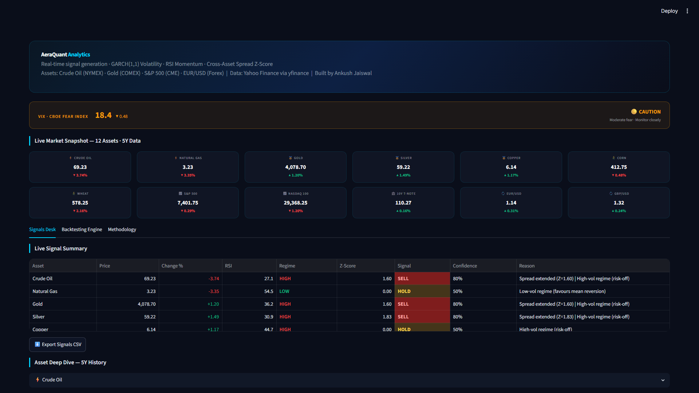
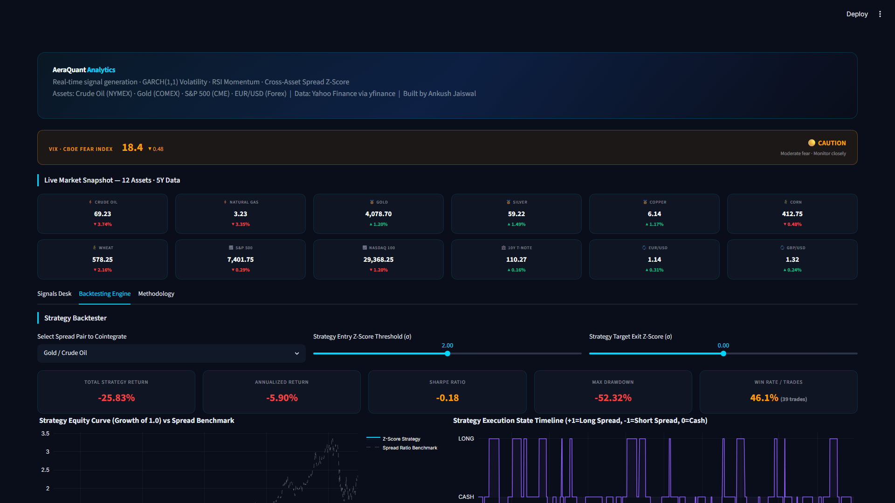

# AeraQuant

[](https://aera-quant.streamlit.app)

AeraQuant is a multi-asset quantitative analytics platform that monitors futures markets using volatility modeling and statistical arbitrage signals.



## Features
- **Data Pipeline:** Fetches OHLCV data for 12 futures contracts (Energy, Metals, Agriculture, Equities, Rates, FX) via `yfinance`.
- **Advanced Cointegration (Kalman Filters):** Dynamically calculates optimal hedge ratios between assets using a State-Space Kalman Filter, adapting instantly to correlation breakdowns.
- **Volatility Modeling (GARCH & HMM):** Fits a GARCH(1,1) model for short-term forecasting, and uses an Unsupervised **Hidden Markov Model (HMM)** for market regime detection without hardcoded thresholds.
- **Market Memory (Hurst Exponent):** Employs Rescaled Range Analysis (Hurst Exponent) to mathematically prove whether a market is mean-reverting (H < 0.5) before taking a trade, blocking trades in trending markets.
- **Backtesting Engine:** Simulates the Kalman Z-Score mean-reversion strategy to calculate Sharpe Ratio, Max Drawdown, and Win Rate.
  

## Project Structure
```
aera_quant/
├── data/
│   └── fetcher.py          # Data ingestion and sector mapping
├── analysis/
│   ├── indicators.py       # RSI, GARCH(1,1), Bollinger Bands
│   ├── spreads.py          # Cointegrated spreads and Z-scores
│   └── backtester.py       # Backtesting simulator
├── dashboard/
│   └── app.py              # Streamlit dashboard
├── requirements.txt        # Python dependencies
```

## Setup and Usage

1. **Clone the repository:**
   ```bash
   git clone https://github.com/YOUR_USERNAME/aera-quant.git
   cd aera-quant
   ```

2. **Install dependencies:**
   ```bash
   pip install -r requirements.txt
   ```

3. **Run the dashboard:**
   ```bash
   streamlit run dashboard/app.py
   ```

## Methodology Notes
- The GARCH(1,1) model requires at least 5 years of daily data (~1260 observations) for parameter stability.
- Spread Z-scores are computed using a rolling 20-day window. Entries are signaled at `|Z| > 2.0`.
- The system checks VIX levels; VIX > 25 is treated as a risk-off regime, suppressing standard mean-reversion buy signals due to correlation breakdowns.

## Deployment
This project is configured to run on Streamlit Community Cloud. 
1. Push to a public GitHub repository.
2. Link the repository in Streamlit Community Cloud and set `dashboard/app.py` as the entry point.
3. Dependencies (including `arch` and `plotly`) will install automatically from `requirements.txt`.

*Disclaimer: For educational and research purposes only. Not financial advice.*
